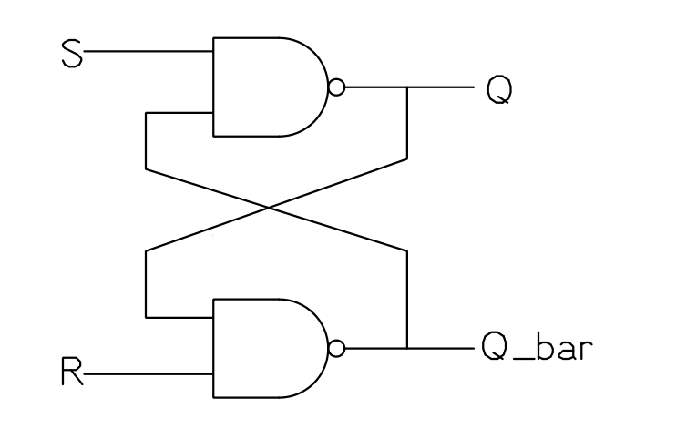
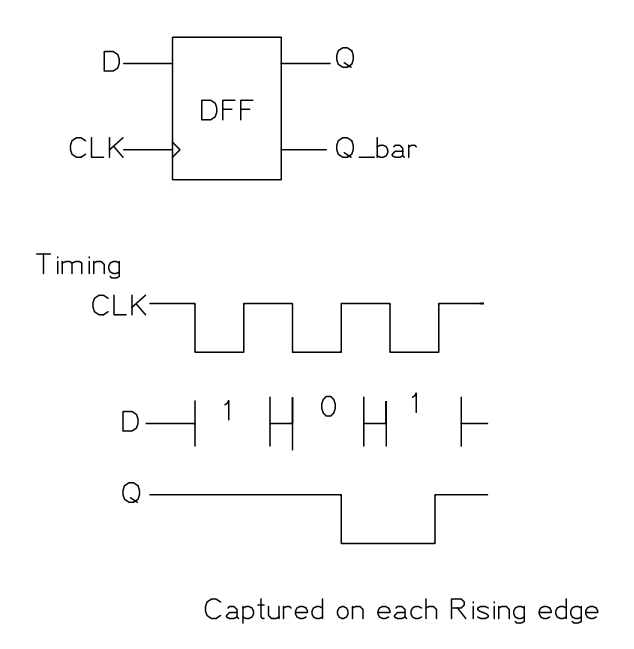
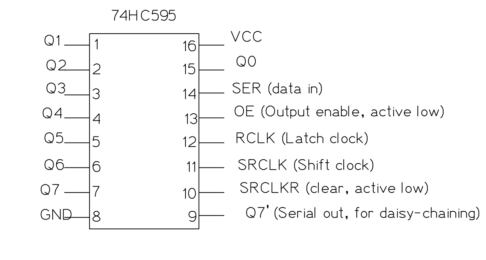

import TawkWidget from '../../../../components/TawkWidget.astro';
import UniversalContentContributors from '../../../../components/UniversalContentContributors.astro';
import InArticleAd from '../../../../components/InArticleAd.astro';
import Copyright from '../../../../components/Copyright.astro';
import BionicText from '../../../../components/BionicText.astro';
import TailwindWrapper from '../../../../components/TailwindWrapper.jsx';
import { Tabs, TabItem } from '@astrojs/starlight/components';
import { Card, CardGrid, Badge, Steps, LinkButton, FileTree } from '@astrojs/starlight/components';

<UniversalContentContributors 
  contributors={frontmatter.contributors}
/>


import DigitalElectronicsComments from '../../../../components/digital-electronics/DigitalElectronicsComments.astro';

Until now, every circuit we built was combinational: the output depended only on the current inputs. But real digital systems need memory. A traffic light controller needs to remember which state it is in. A counter needs to remember its current count. A communication interface needs to receive bits one at a time and assemble them into a byte. All of this requires flip-flops, the fundamental one-bit memory elements that make sequential logic possible. #FlipFlops #ShiftRegisters #SequentialLogic

## From Combinational to Sequential

The key difference:

| Property | Combinational | Sequential |
|----------|--------------|-----------|
| Memory | None | Stores state |
| Output depends on | Current inputs only | Current inputs AND stored state |
| Clock | Not required | Usually clocked |
| Examples | Gates, mux, decoder, adder | Flip-flops, registers, counters |

Sequential circuits are built by adding feedback (connecting outputs back to inputs) and a clock signal to combinational logic.

## The SR Latch

<InArticleAd />


### Concept

The SR (Set-Reset) latch is the simplest memory element. It stores one bit and has two inputs:

- **S (Set):** sets the output to 1
- **R (Reset):** sets the output to 0

### SR Latch from NAND Gates

Two cross-coupled NAND gates form an SR latch. The output of each gate feeds back to the input of the other:



*Figure: SR Latch*

**Truth table (active-low inputs for NAND implementation):**

| S | R | Q (next) | Q̄ (next) | Action |
|---|---|----------|-----------|--------|
| 1 | 1 | Q (hold) | Q̄ (hold) | No change |
| 0 | 1 | 1 | 0 | Set |
| 1 | 0 | 0 | 1 | Reset |
| 0 | 0 | Invalid | Invalid | Forbidden |

The "forbidden" state (both inputs active) is a problem because both outputs try to go high, and the result when the inputs are released is unpredictable. This limitation is what motivates the D flip-flop.

### SR Latch from NOR Gates

Two cross-coupled NOR gates also form an SR latch, but with active-high inputs:

| S | R | Q (next) | Action |
|---|---|----------|--------|
| 0 | 0 | Q (hold) | No change |
| 1 | 0 | 1 | Set |
| 0 | 1 | 0 | Reset |
| 1 | 1 | Invalid | Forbidden |

The NOR-based SR latch is the conceptual starting point, but the NAND version is more common in practice because NAND gates are the natural building block in CMOS technology.

## The D Flip-Flop

<InArticleAd />


### Why D Flip-Flops?

The SR latch has two problems: the forbidden state and the lack of a clock. The D (Data) flip-flop solves both. It has:

- **D (Data) input:** the value to store
- **CLK (Clock) input:** when to store it
- **Q output:** the stored value
- **Q̄ output:** the complement of the stored value

### How It Works



*Figure: D Flip-Flop*

On the rising edge of the clock (the moment CLK transitions from 0 to 1), the value on the D input is captured and held at Q. At all other times, Q retains its previous value regardless of what D does.

**Characteristic table:**

| CLK Edge | D | Q (next) |
|----------|---|----------|
| Rising | 0 | 0 |
| Rising | 1 | 1 |
| No edge | X | Q (hold) |

This is exactly what a register inside a CPU does: capture data at a specific clock edge and hold it stable until the next capture.

### Timing Concepts

Two critical timing parameters:

- **Setup time ($t_{su}$):** the data input must be stable for at least this long *before* the clock edge. If violated, the output may be unpredictable (metastability).
- **Hold time ($t_h$):** the data input must remain stable for at least this long *after* the clock edge.

For the 74HC74 (dual D flip-flop), typical setup time is about 14 ns and hold time is about 3 ns at 5V.

### Building a D Flip-Flop from NAND Gates

A positive-edge-triggered D flip-flop can be built from six NAND gates. The circuit uses a master-slave arrangement where the master captures data when the clock is low, and the slave transfers it to the output when the clock goes high. The construction details are in most digital electronics textbooks, but the important thing to understand is the behavior: data is captured on the clock edge.

## The JK Flip-Flop

<InArticleAd />


### Concept

The JK flip-flop eliminates the forbidden state of the SR latch. When both J and K inputs are 1 on a clock edge, the output toggles instead of becoming undefined.

**Characteristic table:**

| J | K | Q (next) | Action |
|---|---|----------|--------|
| 0 | 0 | Q | Hold |
| 0 | 1 | 0 | Reset |
| 1 | 0 | 1 | Set |
| 1 | 1 | $\overline{Q}$ | Toggle |

The toggle mode (J=K=1) is particularly useful for building counters, where each flip-flop needs to toggle on certain clock edges.

### JK vs D

In modern designs, D flip-flops are far more common than JK flip-flops because:

1. D flip-flops are simpler (fewer gates)
2. The toggle function can be achieved with D flip-flops using feedback ($D = \overline{Q}$)
3. Synthesis tools and FPGAs use D flip-flops exclusively

JK flip-flops are primarily of historical and educational interest, but understanding the toggle behavior helps explain how counters work.

## Shift Registers

<InArticleAd />


### Concept

A shift register is a chain of D flip-flops where the output of each flip-flop connects to the input of the next. On each clock edge, every bit shifts one position.

### 4-Bit Serial-In, Parallel-Out (SIPO) Shift Register

```
Data In ──→ [D FF 0] ──→ [D FF 1] ──→ [D FF 2] ──→ [D FF 3]
                │             │             │             │
               Q0            Q1            Q2            Q3
```

On each clock pulse, the data shifts right:

| Clock Pulse | Data In | Q3 | Q2 | Q1 | Q0 |
|------------|---------|----|----|----|----|
| Initial | - | 0 | 0 | 0 | 0 |
| 1 | 1 | 0 | 0 | 0 | 1 |
| 2 | 0 | 0 | 0 | 1 | 0 |
| 3 | 1 | 0 | 1 | 0 | 1 |
| 4 | 1 | 1 | 0 | 1 | 1 |

After 4 clock pulses, the serial data `1011` has been loaded into the register and is available on all four outputs simultaneously.

### Types of Shift Registers

| Type | Serial Input | Parallel Input | Serial Output | Parallel Output |
|------|-------------|---------------|--------------|----------------|
| SIPO | Yes | No | No | Yes |
| PISO | No | Yes | Yes | No |
| SISO | Yes | No | Yes | No |
| PIPO | No | Yes | No | Yes |

The 74HC595 is a SIPO shift register with an output latch. The 74HC164 is a simpler SIPO without the latch.

## The 74HC595: Your Most Useful IC

<InArticleAd />


### Why the 74HC595 Matters

The 74HC595 is an 8-bit serial-in, parallel-out shift register with a storage register and output enable. It lets you control 8 outputs using only 3 signals from your microcontroller:

- **SER (serial data in):** the bit to shift in
- **SRCLK (shift register clock):** shifts the data one position on each rising edge
- **RCLK (register/latch clock):** transfers the shift register contents to the output pins

### 74HC595 Pin Layout



*Figure: 74HC595 Shift Register*


**Key connections:**

| Pin | Name | Connect To |
|-----|------|-----------|
| 8 | GND | Ground |
| 16 | VCC | 5V |
| 10 | SRCLR | 5V (to disable clear) |
| 13 | OE | GND (to enable outputs permanently) |
| 14 | SER | MCU data pin |
| 11 | SRCLK | MCU clock pin |
| 12 | RCLK | MCU latch pin |
| 15, 1-7 | Q0-Q7 | LEDs (through 220 ohm resistors) |
| 9 | Q7' | SER of next 74HC595 (for daisy-chaining) |

### How Data Flows Through the 74HC595

<Steps>
1. **Set the data bit** on the SER pin (high or low).
2. **Pulse SRCLK** (low to high). The bit on SER shifts into position 0 of the internal shift register, and all existing bits shift one position toward Q7.
3. **Repeat** steps 1 and 2 for all 8 bits (MSB first is conventional).
4. **Pulse RCLK** (low to high). The 8 bits in the shift register are transferred to the output latch, and Q0 through Q7 update simultaneously.
</Steps>

The latch (RCLK) is what makes this IC practical. Without it, the outputs would show intermediate "garbage" values as bits shift through. With the latch, the outputs update cleanly in one step.

## Practical: Drive 8 LEDs from 3 MCU Pins

<InArticleAd />


### Parts Needed

| Component | Quantity |
|-----------|----------|
| 74HC595 | 1 |
| LEDs | 8 |
| 220 ohm resistors | 8 |
| Breadboard | 1 |
| 5V power supply | 1 |
| Jumper wires | assorted |
| Push buttons (or an MCU) | 3 |

### Wiring

<Steps>
1. **Place the 74HC595** on the breadboard.

2. **Power:** pin 16 to 5V, pin 8 to GND.

3. **Tie SRCLR (pin 10) to 5V** to prevent accidental clearing.

4. **Tie OE (pin 13) to GND** to enable all outputs.

5. **Connect 8 LEDs:** Each LED's anode connects to one output pin (Q0 through Q7) through a 220 ohm resistor. Each LED's cathode connects to GND.
   - Q0 (pin 15) through resistor to LED 0
   - Q1 (pin 1) through resistor to LED 1
   - Q2 (pin 2) through resistor to LED 2
   - Q3 (pin 3) through resistor to LED 3
   - Q4 (pin 4) through resistor to LED 4
   - Q5 (pin 5) through resistor to LED 5
   - Q6 (pin 6) through resistor to LED 6
   - Q7 (pin 7) through resistor to LED 7

6. **Connect the three control signals** to push buttons (for manual testing) or to MCU pins.
</Steps>

### Manual Test Procedure

To display the pattern `10110011` (0xB3) on the LEDs:

<Steps>
1. Set SER high (bit 7 = 1). Pulse SRCLK.
2. Set SER low (bit 6 = 0). Pulse SRCLK.
3. Set SER high (bit 5 = 1). Pulse SRCLK.
4. Set SER high (bit 4 = 1). Pulse SRCLK.
5. Set SER low (bit 3 = 0). Pulse SRCLK.
6. Set SER low (bit 2 = 0). Pulse SRCLK.
7. Set SER high (bit 1 = 1). Pulse SRCLK.
8. Set SER high (bit 0 = 1). Pulse SRCLK.
9. Pulse RCLK. All 8 LEDs update at once showing 10110011.
</Steps>

### MCU Code (C, Any Platform)

```c
// Pin definitions (adapt to your MCU)
#define DATA_PIN   // SER (pin 14 on 595)
#define CLOCK_PIN  // SRCLK (pin 11 on 595)
#define LATCH_PIN  // RCLK (pin 12 on 595)

void shiftOut(uint8_t data) {
    // Shift out 8 bits, MSB first
    for (int8_t i = 7; i >= 0; i--) {
        // Set data pin to the current bit
        if (data & (1 << i)) {
            // Set DATA_PIN high
        } else {
            // Set DATA_PIN low
        }

        // Pulse the clock: low, then high
        // Set CLOCK_PIN low
        // Set CLOCK_PIN high
    }

    // Pulse the latch to transfer data to outputs
    // Set LATCH_PIN low
    // Set LATCH_PIN high
}
```

This `shiftOut` function is exactly what the Arduino `shiftOut()` function does internally. It is also exactly what the SPI peripheral does in hardware (more on this in Lesson 7).

### Daisy-Chaining for More Outputs

```text
  74HC595 driving 8 LEDs from 3 MCU pins

  MCU                    74HC595
  ┌──────┐             ┌──────────┐
  │      ├── SER ────→│14  SER   │
  │      │             │          ├─Q0──[220R]──LED0
  │      ├── SRCLK ──→│11 SRCLK  ├─Q1──[220R]──LED1
  │      │             │          ├─Q2──[220R]──LED2
  │      ├── RCLK ───→│12  RCLK  ├─Q3──[220R]──LED3
  │      │             │          ├─Q4──[220R]──LED4
  └──────┘             │   VCC=16 ├─Q5──[220R]──LED5
   3 pins              │   GND= 8 ├─Q6──[220R]──LED6
   control             │   OE =13→GND ├─Q7──[220R]──LED7
   8 outputs           │  CLR=10→VCC │
                       └──────────┘
```

Connect Q7' (pin 9) of the first 74HC595 to SER (pin 14) of a second 74HC595. Share the SRCLK and RCLK lines. Now shift out 16 bits instead of 8, and both chips update simultaneously when you pulse RCLK.

This scales to any number of shift registers. With three 74HC595s, you control 24 outputs from the same 3 MCU pins.

## Parallel Load Registers

<InArticleAd />


### Concept

While shift registers load data serially (one bit per clock), parallel load registers load all bits simultaneously on a clock edge. Every register inside your MCU's CPU is a parallel load register.

A 4-bit parallel load register has:
- 4 data inputs ($D_0$ through $D_3$)
- 1 clock input
- 1 load enable input
- 4 outputs ($Q_0$ through $Q_3$)

When load enable is active, on the clock edge all four D inputs are captured simultaneously.

### Register Files

A CPU register file is a collection of parallel load registers (typically 16 or 32 registers, each 32 bits wide on ARM Cortex-M). A decoder selects which register to read or write based on the register number encoded in the instruction.

```text
  CPU Register File (simplified)

  Instruction bits [3:0]
         │
    ┌────┴────┐
    │ 4-to-16 │
    │ Decoder  │
    └────┬────┘
         │ enable lines
    ┌────┼────────────────────┐
    │  ┌─┴──┐ ┌────┐   ┌────┐│
    │  │ R0 │ │ R1 │...│R15 ││
    │  └─┬──┘ └─┬──┘   └─┬──┘│
    └────┼──────┼────────┼───┘
         └──────┴────┬───┘
                     │
           Data Bus [31:0]

  Only the decoded register captures
  data on the write clock edge.
```

## Exercises

<InArticleAd />


### Exercise 1: Shift Register Timing

You have a 4-bit shift register initialized to `0000`. The data input sequence is: 1, 1, 0, 1, 0, 1 (applied before each clock pulse). What are the register contents ($Q_3 Q_2 Q_1 Q_0$) after each of the 6 clock pulses?

<details>
<summary>**Solution**</summary>

| Clock | Data In | Q3 | Q2 | Q1 | Q0 |
|-------|---------|----|----|----|----|
| 0 (init) | - | 0 | 0 | 0 | 0 |
| 1 | 1 | 0 | 0 | 0 | 1 |
| 2 | 1 | 0 | 0 | 1 | 1 |
| 3 | 0 | 0 | 1 | 1 | 0 |
| 4 | 1 | 1 | 1 | 0 | 1 |
| 5 | 0 | 1 | 0 | 1 | 0 |
| 6 | 1 | 0 | 1 | 0 | 1 |

Note: data enters at Q0 and shifts toward Q3.

</details>

### Exercise 2: 74HC595 Bit Order

You send the byte `0x55` (binary `01010101`) MSB-first to a 74HC595. Which LEDs (Q0 through Q7) are on?

<details>
<summary>**Solution**</summary>

MSB first means bit 7 is shifted in first and ends up at Q7. Bit 0 is shifted in last and ends up at Q0.

- Q7 = 0, Q6 = 1, Q5 = 0, Q4 = 1, Q3 = 0, Q2 = 1, Q1 = 0, Q0 = 1

LEDs on Q0, Q2, Q4, Q6 are on. LEDs on Q1, Q3, Q5, Q7 are off. This creates an alternating on/off pattern.

</details>

### Exercise 3: Cascaded Shift Registers

You have two 74HC595s daisy-chained (16 outputs total). You want to display `0xA5B3` on the 16 LEDs. In what order do you shift the bits, and which byte goes first?

<details>
<summary>**Solution**</summary>

Shift out the MSB of the entire 16-bit value first. The first byte shifted (`0xA5`) will end up in the second chip (farther from the MCU), and the second byte shifted (`0xB3`) will end up in the first chip (closest to the MCU).

Shift order: `0xA5` first (8 clock pulses), then `0xB3` (8 more clock pulses), then pulse RCLK once.

Chip 1 (closest to MCU) displays Q7..Q0 = `0xB3` = `10110011`.
Chip 2 (farther from MCU) displays Q7..Q0 = `0xA5` = `10100101`.

</details>

## How This Connects to Embedded Programming

<InArticleAd />


<CardGrid>
  <Card title="SPI Is a Shift Register" icon="setting">
    The SPI bus works exactly like the 74HC595. The MCU's SPI peripheral contains an internal shift register. When you call `HAL_SPI_Transmit()`, data is shifted out one bit per clock, and simultaneously data from the slave shifts in. SPI is literally two shift registers connected in a ring.
  </Card>

  <Card title="GPIO Expanders" icon="open-book">
    Running out of GPIO pins? SPI-connected GPIO expanders (like the MCP23S17) use shift registers internally. The 74HC595 exercise in this lesson is a simplified version of what these expanders do.
  </Card>

  <Card title="CPU Registers" icon="rocket">
    The R0 through R15 registers in an ARM Cortex-M CPU are 32-bit parallel load registers. When you write `MOV R0, #5`, the value 5 is loaded into the R0 register on a clock edge. The register file holds its contents between instructions.
  </Card>

  <Card title="LED Matrix and Display Drivers" icon="approve-check">
    LED matrices, seven-segment displays, and LCD controllers use shift registers to reduce pin count. The MAX7219 LED driver, for example, is an SPI-connected shift register with constant-current LED drivers.
  </Card>
</CardGrid>

## Summary

<InArticleAd />


| Component | Function | Key Property |
|-----------|----------|-------------|
| SR latch | Set/reset memory | No clock, has forbidden state |
| D flip-flop | Capture data on clock edge | The standard building block of sequential logic |
| JK flip-flop | Set/reset/toggle on clock edge | Toggle mode useful for counters |
| Shift register (SIPO) | Serial to parallel conversion | 74HC595 drives 8 outputs from 3 pins |
| Shift register (PISO) | Parallel to serial conversion | Used in keyboard scanners, SPI slaves |
| Parallel load register | Capture all bits simultaneously | CPU register file, data latches |

In the next lesson, you will connect flip-flops into counters and timers, the circuits that keep time and generate waveforms inside every microcontroller.

<DigitalElectronicsComments />


<InArticleAd />
<TawkWidget />
<Copyright />