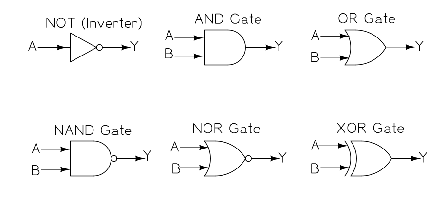
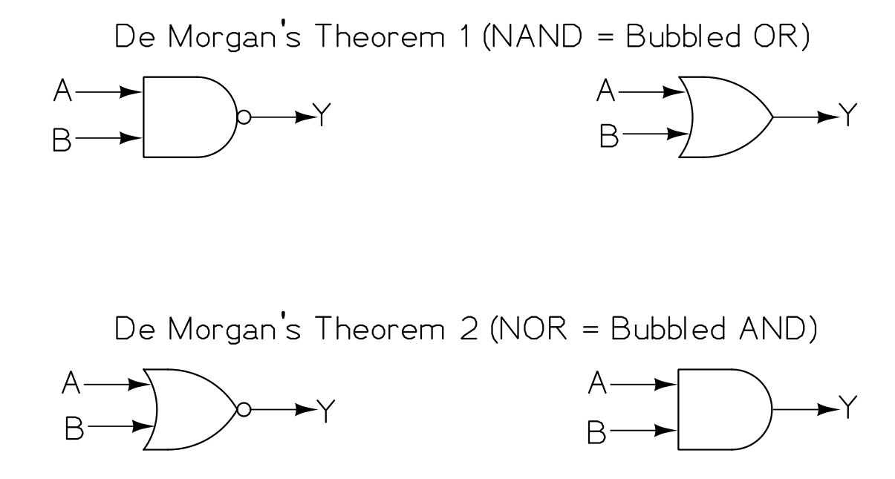
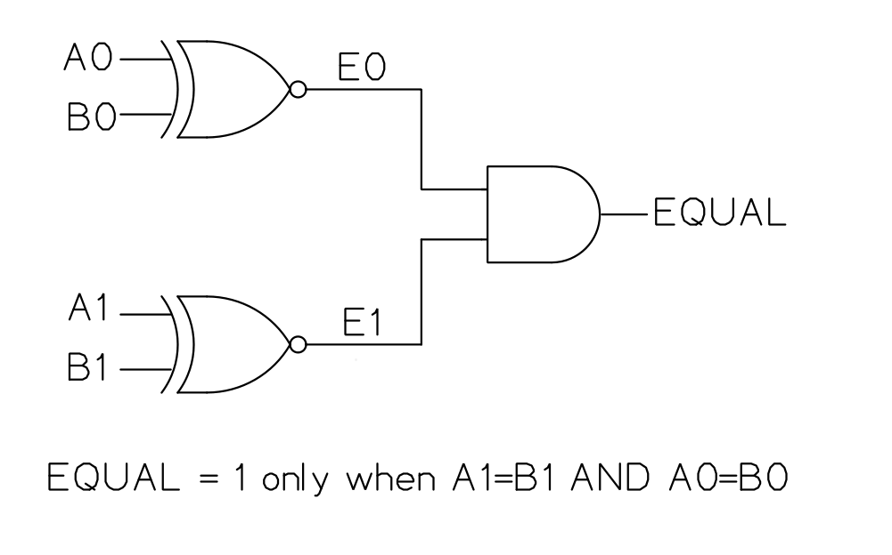
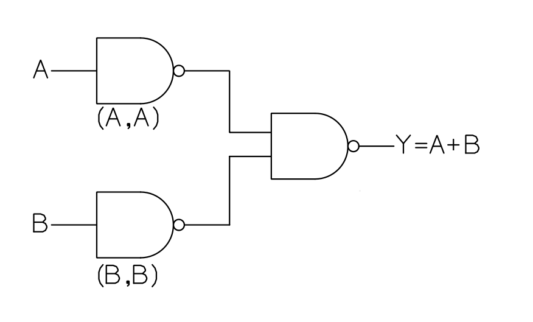

import TawkWidget from '../../../../components/TawkWidget.astro';
import UniversalContentContributors from '../../../../components/UniversalContentContributors.astro';
import InArticleAd from '../../../../components/InArticleAd.astro';
import Copyright from '../../../../components/Copyright.astro';
import BionicText from '../../../../components/BionicText.astro';
import TailwindWrapper from '../../../../components/TailwindWrapper.jsx';
import { Tabs, TabItem } from '@astrojs/starlight/components';
import { Card, CardGrid, Badge, Steps, LinkButton, FileTree } from '@astrojs/starlight/components';

<UniversalContentContributors 
  contributors={frontmatter.contributors}
/>


import DigitalElectronicsComments from '../../../../components/digital-electronics/DigitalElectronicsComments.astro';

Logic gates are the smallest building blocks of digital hardware. Every microcontroller, every processor, and every digital circuit is built from combinations of AND, OR, and NOT gates. When you write `PORTB |= (1 << 5);` in C, the compiler generates an instruction, and the CPU executes it using physical OR gates inside the chip. This lesson puts those gates on a breadboard so you can see them work. #LogicGates #BooleanAlgebra #DigitalCircuits

## The Six Fundamental Gates

Every digital circuit, no matter how complex, is built from these six gate types. Each gate takes one or two binary inputs and produces one binary output.



*Figure: Six Fundamental Gates*

### NOT Gate (Inverter)

The NOT gate has one input and one output. It inverts the input: 0 becomes 1, and 1 becomes 0.

**Truth table:**

| Input A | Output Y |
|---------|----------|
| 0 | 1 |
| 1 | 0 |

**Boolean expression:** $Y = \overline{A}$ (also written as $Y = A'$ or $Y = \lnot A$)

**C equivalent:** `y = ~a;` (bitwise NOT)

**IC:** 74HC04 (hex inverter, six independent NOT gates in one package)

### AND Gate

The AND gate outputs 1 only when both inputs are 1.

**Truth table:**

| Input A | Input B | Output Y |
|---------|---------|----------|
| 0 | 0 | 0 |
| 0 | 1 | 0 |
| 1 | 0 | 0 |
| 1 | 1 | 1 |

**Boolean expression:** $Y = A \cdot B$ (or simply $Y = AB$)

**C equivalent:** `y = a & b;` (bitwise AND)

**IC:** 74HC08 (quad 2-input AND, four independent AND gates)

**Embedded use:** Masking bits. `PINB & (1 << 5)` tests whether bit 5 is high by ANDing with a mask that has only bit 5 set.

### OR Gate

The OR gate outputs 1 when at least one input is 1.

**Truth table:**

| Input A | Input B | Output Y |
|---------|---------|----------|
| 0 | 0 | 0 |
| 0 | 1 | 1 |
| 1 | 0 | 1 |
| 1 | 1 | 1 |

**Boolean expression:** $Y = A + B$

**C equivalent:** `y = a | b;` (bitwise OR)

**IC:** 74HC32 (quad 2-input OR)

**Embedded use:** Setting bits. `PORTB |= (1 << 5)` sets bit 5 by ORing with a mask.

### NAND Gate

The NAND gate is an AND followed by a NOT. It outputs 0 only when both inputs are 1.

**Truth table:**

| Input A | Input B | Output Y |
|---------|---------|----------|
| 0 | 0 | 1 |
| 0 | 1 | 1 |
| 1 | 0 | 1 |
| 1 | 1 | 0 |

**Boolean expression:** $Y = \overline{A \cdot B}$

**IC:** 74HC00 (quad 2-input NAND)

NAND is called a "universal gate" because you can build any other gate from NAND gates alone. This is why NAND flash memory uses NAND structures internally.

### NOR Gate

The NOR gate is an OR followed by a NOT. It outputs 1 only when both inputs are 0.

**Truth table:**

| Input A | Input B | Output Y |
|---------|---------|----------|
| 0 | 0 | 1 |
| 0 | 1 | 0 |
| 1 | 0 | 0 |
| 1 | 1 | 0 |

**Boolean expression:** $Y = \overline{A + B}$

NOR is also a universal gate. Like NAND, you can construct any logic function using only NOR gates.

### XOR Gate (Exclusive OR)

The XOR gate outputs 1 when the inputs are different.

**Truth table:**

| Input A | Input B | Output Y |
|---------|---------|----------|
| 0 | 0 | 0 |
| 0 | 1 | 1 |
| 1 | 0 | 1 |
| 1 | 1 | 0 |

**Boolean expression:** $Y = A \oplus B$

**C equivalent:** `y = a ^ b;` (bitwise XOR)

**IC:** 74HC86 (quad 2-input XOR)

**Embedded use:** Toggling bits. `PORTB ^= (1 << 5)` toggles bit 5 by XORing with a mask.

XOR is also the basis of parity checking, CRC calculations, and simple encryption.

## 74HC Series IC Pinouts

<InArticleAd />


The 74HC family uses CMOS technology and operates at 2V to 6V, making it compatible with both 3.3V and 5V systems. All quad-gate ICs in this family share a similar 14-pin DIP package layout.

### 74HC08 (Quad AND) Pin Layout

.png)

*Figure: 74HC08 Pin Layout*

- Pin 7 = GND (connect to 0V)
- Pin 14 = VCC (connect to 5V)
- Gate 1: inputs on pins 1, 2; output on pin 3
- Gate 2: inputs on pins 4, 5; output on pin 6
- Gate 3: inputs on pins 9, 10; output on pin 8
- Gate 4: inputs on pins 12, 13; output on pin 11

The 74HC00 (NAND), 74HC32 (OR), and 74HC86 (XOR) all use the same pinout. Only the gate function differs.

### 74HC04 (Hex Inverter) Pin Layout

.png)

*Figure: 74HC04 Pin Layout*

Each inverter has one input and one output. There are six inverters in one package.

## Practical: Build and Verify Truth Tables

<InArticleAd />


### Parts Needed

| Component | Quantity |
|-----------|----------|
| Breadboard | 1 |
| 74HC08 (AND) | 1 |
| 74HC32 (OR) | 1 |
| 74HC04 (NOT) | 1 |
| LEDs (any color) | 3 |
| 220 ohm resistors | 3 |
| 10K ohm resistors | 2 |
| Push buttons | 2 |
| 5V power supply | 1 |
| Jumper wires | assorted |

### Wiring the AND Gate

<Steps>
1. **Place the 74HC08** across the center groove of the breadboard, straddling the gap.

2. **Connect power:** pin 14 to the 5V rail, pin 7 to the GND rail.

3. **Wire input A (pin 1)** to a push button. Connect a 10K pull-down resistor from pin 1 to GND. The button connects pin 1 to 5V when pressed. When not pressed, the pull-down holds the input at 0.

4. **Wire input B (pin 2)** the same way with a second push button and pull-down resistor.

5. **Wire the output (pin 3)** to an LED through a 220 ohm resistor. Connect the LED anode to pin 3 (through the resistor) and the cathode to GND.

6. **Test all four input combinations:**
   - Both buttons released: LED off (0 AND 0 = 0)
   - Button A only: LED off (1 AND 0 = 0)
   - Button B only: LED off (0 AND 1 = 0)
   - Both buttons pressed: LED on (1 AND 1 = 1)
</Steps>

### Wiring the OR Gate

Use the same circuit but replace the 74HC08 with the 74HC32. Now the LED lights when either or both buttons are pressed.

### Wiring the NOT Gate

Use the 74HC04. Connect one push button (with pull-down) to pin 1 (input). Connect pin 2 (output) to an LED with a 220 ohm resistor. The LED will be on when the button is not pressed and off when it is pressed.

:::tip[Debugging tip]
If your circuit does not work, check these common issues first: (1) VCC and GND are connected to the correct pins, (2) the IC is oriented correctly (the notch or dot marks pin 1), (3) you have pull-down or pull-up resistors on floating inputs.
:::

## Boolean Algebra

<InArticleAd />


Boolean algebra is the mathematics of logic. It lets you analyze, simplify, and design digital circuits using algebraic rules.

### Basic Laws

| Law | AND Form | OR Form |
|-----|----------|---------|
| Identity | $A \cdot 1 = A$ | $A + 0 = A$ |
| Null | $A \cdot 0 = 0$ | $A + 1 = 1$ |
| Idempotent | $A \cdot A = A$ | $A + A = A$ |
| Complement | $A \cdot \overline{A} = 0$ | $A + \overline{A} = 1$ |
| Commutative | $A \cdot B = B \cdot A$ | $A + B = B + A$ |
| Associative | $(AB)C = A(BC)$ | $(A+B)+C = A+(B+C)$ |
| Distributive | $A(B+C) = AB + AC$ | $A + BC = (A+B)(A+C)$ |

### De Morgan's Theorems

These two theorems are among the most useful tools in digital design:

**Theorem 1:** $\overline{A \cdot B} = \overline{A} + \overline{B}$

The complement of AND equals the OR of the complements. A NAND gate is equivalent to an OR gate with inverted inputs.

**Theorem 2:** $\overline{A + B} = \overline{A} \cdot \overline{B}$

The complement of OR equals the AND of the complements. A NOR gate is equivalent to an AND gate with inverted inputs.



*Figure: De Morgan's Theorem*

**In C code, De Morgan's theorems look like this:**

```c
// These two expressions are equivalent:
!(a && b)    ==    (!a || !b)

// These two expressions are equivalent:
!(a || b)    ==    (!a && !b)

// For bitwise operations:
~(a & b)     ==    (~a | ~b)
~(a | b)     ==    (~a & ~b)
```

### Simplification Example

Simplify: $Y = A\overline{B} + AB$

<Steps>
1. Factor out $A$: $Y = A(\overline{B} + B)$
2. Apply the complement law ($\overline{B} + B = 1$): $Y = A \cdot 1$
3. Apply the identity law: $Y = A$
</Steps>

The output depends only on $A$, regardless of $B$. If this were a circuit, you could remove the $B$ input entirely and save gates.

### Another Example

Simplify: $Y = \overline{A}B + A\overline{B} + AB$

<Steps>
1. Group the last two terms: $Y = \overline{A}B + A(\overline{B} + B)$
2. Simplify: $Y = \overline{A}B + A$
3. Apply the absorption law ($A + \overline{A}B = A + B$): $Y = A + B$
</Steps>

The original expression with three terms reduces to a simple OR. In hardware, that means replacing multiple gates with a single OR gate.

### Karnaugh Maps (K-maps)

For expressions with three or four variables, Karnaugh maps provide a visual method for simplification. A K-map arranges truth table entries in a grid where adjacent cells differ by only one variable.

**Two-variable K-map for $Y = \overline{A}B + A\overline{B} + AB$:**

|  | B=0 | B=1 |
|--|-----|-----|
| **A=0** | 0 | 1 |
| **A=1** | 1 | 1 |

Group the two cells in the A=1 row (giving $A$) and the two cells in the B=1 column (giving $B$). The simplified expression is $Y = A + B$.

**Three-variable K-map layout:**

|  | $\overline{B}\,\overline{C}$ | $\overline{B}\,C$ | $B\,C$ | $B\,\overline{C}$ |
|--|---|---|---|---|
| **$\overline{A}$** | $m_0$ | $m_1$ | $m_3$ | $m_2$ |
| **$A$** | $m_4$ | $m_5$ | $m_7$ | $m_6$ |

Notice the column order uses Gray code (only one variable changes between adjacent columns), so that adjacent cells always differ by exactly one variable. Group rectangular blocks of 1, 2, 4, or 8 adjacent cells to find the simplest expression.

## Multi-Gate Combination Example

<InArticleAd />


A practical circuit often chains several gate types. Here is a 2-bit equality comparator that outputs 1 when A1A0 equals B1B0:



*Figure: Multi-Gate Combination*

XNOR outputs 1 when its two inputs match. ANDing the per-bit results gives a full equality test. This pattern scales: an 8-bit comparator uses 8 XNOR gates feeding an 8-input AND tree.

## NAND as a Universal Gate

<InArticleAd />


Any logic function can be built using only NAND gates. This is practically important because manufacturing one type of gate is simpler and cheaper. Here is how to build each basic gate from NAND:

**NOT from NAND:** Connect both inputs of a NAND gate together.

| A (both inputs) | NAND output |
|-----------------|-------------|
| 0 | 1 |
| 1 | 0 |

This is a NOT gate.

**AND from NAND:** Use two NAND gates. The first performs NAND, the second inverts the result.

$$Y = \overline{\overline{A \cdot B}} = A \cdot B$$

**OR from NAND:** Use three NAND gates. First invert both inputs (two NANDs with tied inputs), then NAND the results.

By De Morgan's theorem: $\overline{\overline{A} \cdot \overline{B}} = A + B$



*Figure: NAND as a Universal Gate*

This is why the 74HC00 (quad NAND) is often called the most versatile IC in the 74HC family. With enough 74HC00s, you can build any digital circuit.

## Practical: Build a NAND-Only OR Gate

<InArticleAd />


<Steps>
1. **Use a single 74HC00** (quad NAND) IC on your breadboard.

2. **Gate 1 (inverter for A):** Connect your first push button (with pull-down) to both pins 1 and 2. The output on pin 3 is $\overline{A}$.

3. **Gate 2 (inverter for B):** Connect your second push button (with pull-down) to both pins 4 and 5. The output on pin 6 is $\overline{B}$.

4. **Gate 3 (NAND of inverted inputs):** Connect pin 3 to pin 9, pin 6 to pin 10. The output on pin 8 is $\overline{\overline{A} \cdot \overline{B}} = A + B$.

5. **Connect pin 8** to an LED through a 220 ohm resistor.

6. **Verify:** The LED behaves exactly like an OR gate. It lights when either or both buttons are pressed.
</Steps>

You have just built an OR gate from NAND gates, demonstrating the universal property.

## Gate Propagation Delay

<InArticleAd />


Real gates do not switch instantaneously. The 74HC08 AND gate has a typical propagation delay of about 7 nanoseconds at 5V. This means the output takes 7 ns to respond after the input changes.

For a chain of gates, delays add up. If you cascade five gates, the total delay is approximately $5 \times 7 = 35$ ns. At low frequencies this is negligible, but in high-speed circuits (and inside microcontrollers running at tens or hundreds of MHz), propagation delay determines the maximum clock speed.

| Parameter | 74HC Series (5V) | 74HCT Series (5V) |
|-----------|------------------|-------------------|
| Propagation delay | ~7 ns | ~10 ns |
| Maximum frequency | ~40 MHz | ~25 MHz |
| Operating voltage | 2V to 6V | 4.5V to 5.5V |

The 74HCT series has TTL-compatible input thresholds and is used when interfacing with older TTL logic.

## Exercises

<InArticleAd />


### Exercise 1: Truth Table Completion

Complete the truth table for $Y = A \cdot \overline{B} + \overline{A} \cdot B$ (this is XOR):

| A | B | $\overline{A}$ | $\overline{B}$ | $A \cdot \overline{B}$ | $\overline{A} \cdot B$ | Y |
|---|---|---|---|---|---|---|
| 0 | 0 | ? | ? | ? | ? | ? |
| 0 | 1 | ? | ? | ? | ? | ? |
| 1 | 0 | ? | ? | ? | ? | ? |
| 1 | 1 | ? | ? | ? | ? | ? |

<details>
<summary>**Solution**</summary>

| A | B | $\overline{A}$ | $\overline{B}$ | $A \cdot \overline{B}$ | $\overline{A} \cdot B$ | Y |
|---|---|---|---|---|---|---|
| 0 | 0 | 1 | 1 | 0 | 0 | 0 |
| 0 | 1 | 1 | 0 | 0 | 1 | 1 |
| 1 | 0 | 0 | 1 | 1 | 0 | 1 |
| 1 | 1 | 0 | 0 | 0 | 0 | 0 |

This confirms the XOR truth table.

</details>

### Exercise 2: Boolean Simplification

Simplify: $Y = ABC + AB\overline{C} + A\overline{B}C$

<details>
<summary>**Solution**</summary>

1. Group first two terms: $Y = AB(C + \overline{C}) + A\overline{B}C$
2. Simplify: $Y = AB + A\overline{B}C$
3. Factor out $A$: $Y = A(B + \overline{B}C)$
4. Apply the absorption law ($B + \overline{B}C = B + C$): $Y = A(B + C)$
5. Expand if needed: $Y = AB + AC$

</details>

### Exercise 3: Apply De Morgan's Theorem

Rewrite using only AND and NOT operations: $Y = \overline{A + B + C}$

<details>
<summary>**Solution**</summary>

Apply De Morgan's theorem: $Y = \overline{A} \cdot \overline{B} \cdot \overline{C}$

In C: `y = ~a & ~b & ~c;`

</details>

## How This Connects to Embedded Programming

<InArticleAd />


<CardGrid>
  <Card title="Bitwise Operators ARE Logic Gates" icon="setting">
    When you write `PORTB & 0x0F` in C, the ALU inside your MCU performs an AND operation on each pair of corresponding bits using physical AND gates. The truth tables you verified with LEDs are the same truth tables the silicon implements.
  </Card>

  <Card title="Register Bit Masking" icon="open-book">
    Setting, clearing, and toggling bits in peripheral registers (the most common operation in embedded programming) is Boolean algebra applied to hardware. `REG |= mask` is OR. `REG &= ~mask` is AND with NOT. `REG ^= mask` is XOR.
  </Card>

  <Card title="Conditional Logic in Hardware" icon="approve-check">
    Inside the MCU, multiplexers (built from AND and OR gates) route signals based on select lines. Address decoders use NAND/NOR to enable specific peripherals. The logic you built on a breadboard is the same logic inside the chip, just much smaller.
  </Card>

  <Card title="De Morgan's in Optimization" icon="rocket">
    Compilers sometimes apply De Morgan's transformations to optimize conditional expressions. Understanding these theorems helps you write clearer conditions and recognize when two expressions are equivalent.
  </Card>
</CardGrid>

## Summary

<InArticleAd />


| Concept | Key Takeaway |
|---------|-------------|
| NOT, AND, OR | The three fundamental operations. All others derive from these. |
| NAND, NOR | Universal gates. Either one alone can build any logic circuit. |
| XOR | Outputs 1 when inputs differ. Used for toggling, parity, CRC. |
| De Morgan's theorems | $\overline{AB} = \overline{A} + \overline{B}$ and $\overline{A+B} = \overline{A} \cdot \overline{B}$. Essential for simplification. |
| Boolean simplification | Reduces gate count, which reduces cost, power, and propagation delay. |
| 74HC series ICs | Real, physical gates you can wire on a breadboard to verify truth tables. |

In the next lesson, you will combine these gates into larger functional blocks: multiplexers, decoders, and adders.

<DigitalElectronicsComments />


<InArticleAd />
<TawkWidget />
<Copyright />